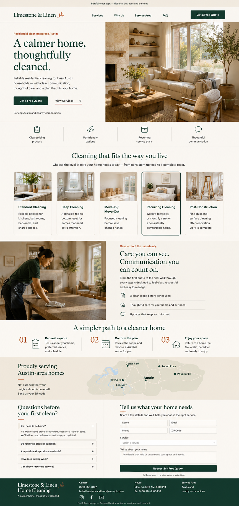
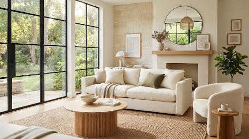

# Limestone & Linen Home Cleaning

A responsive residential cleaning website concept for an upper-middle-market service business in Austin, Texas. The site combines clear service information, an approachable editorial visual direction, transparent service-area messaging, and a focused free-quote path.

**Live demo:** [limestone-linen-cleaning.pages.dev](https://limestone-linen-cleaning.pages.dev/)

## Project preview



### Selected production visuals

| Hero | Care section |
| --- | --- |
|  |  |

## Features

- Responsive single-page marketing website
- Five residential cleaning services
- Trust, process, service-area, FAQ, and quote sections
- Accessible navigation and native FAQ controls
- Frontend quote-request form with validation and success state
- Local optimized photography and an attributed Austin service-area map
- SEO metadata, sitemap, robots file, and social sharing metadata
- Reduced-motion and keyboard-focus support

## Tech stack

- React
- Vite
- JavaScript
- Plain CSS with project design tokens
- Lucide React icons
- Cloudflare Pages

## Run locally

```bash
npm install
npm run dev
```

Run the project checks:

```bash
npm run lint
npm run build
```

## Demo notice

This is a fictional portfolio concept. Limestone & Linen, its team, services, contact information, testimonials, and other business content are demonstration material and do not represent a real company. The quote form does not transmit customer information.
